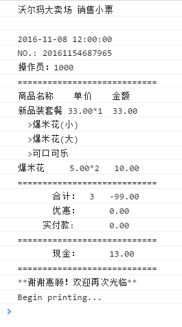

# virtual Printer（小票打印机实现）
## 调试/用法
1. 浏览器运行`/test/index.html` (console输出)
2. `node app.js` (console输出)
3. `vscode`中进入调试模式进行调试

## 文件结构
* `client.js` 客户接口模拟代码
* `compiler.js` label标签编译成hash对象结构
* `printer.js` 打印逻辑，主要处理空格，换行，列间距等，输出treeNode结构
* `nodeDevice.js` 与打印硬件相关逻辑，主要控制打印机输出treeNode指令
* `treeNode.js` treeNode节点对象
* `enums.js` label枚举类型
* `utils.js` 工具方法

## API说明
### Compiler(labelTpl)
```javascript
    <table>
        <tr fontSize="30" fontFamily="黑体">
            <td width="24">ID</td> <!--24个空格宽度，多则换行输出-->
            <td>Name</td>  <!--默认10个空格宽度，多则换行输出-->
            <td>Number</td>
            <td>Price</td>
        </tr>
        <tr>
            <td width="auto">123456</td> <!-- td整行占满 -->
        </tr>
    </table>
```
* `labelTpl`:必填，打印模板，一般三层结构，使用`table`标签控制打印样式
* `fontSize`: 用于`tr`,`table`等非`td`的标签，用于控制字体大小
* `fontFamily`： 用于`tr`,`table`等非`td`的标签，用于控制字体类型
* `width`: 用于`td`，控制单元格宽度，单位是空格，默认值10，`auto`表示占满整行


### NoteDevice(options)
* options:可选，`{"fontSize": 33, "fontFamily": "宋体"}`

### VirtualPrinter(deviceObject, options)
* deviceObject:必填， `new NoteDevice()`
* options：可选，`{colWidth: 10, borderWidth: 1}`，列宽：10个字符，边框宽度:1个字符

## 例子
```javascript
var labelTpl = '<table> \
        <tr fontSize="30" fontFamily="黑体"><td width="24">沃尔玛大卖场 销售小票</td></tr> \
        <tr></tr> \
        <tr>2016-11-08 12:00:00</tr> \
        <tr>NO.: 20161154687965</tr> \
        <tr>操作员：1000</tr> \
        <tr width="auto">============================</tr> \
        <tr><td  width="11">商品名称</td><td width="7">单价</td><td>金额</td></tr> \
        <tr><td>新品装套餐</td><td width="8">33.00*1</td><td>33.00</td></tr> \
        <tr>  >爆米花(小)</tr> \
        <tr>  >爆米花(大)</tr> \
        <tr>  >可口可乐</tr> \
        <tr><td>爆米花</td><td width="8">5.00*2</td><td>10.00</td></tr> \
        <tr width="auto">============================</tr> \
        <tr><td width="6"></td><td width="7">合计：</td><td width="3">3</td><td>-99.00</td></tr> \
        <tr><td width="6"></td><td width="7">优惠：</td><td width="3"></td><td>0.00</td></tr> \
        <tr><td width="4"></td><td>实付款:</td><td width="2"></td><td>0.00</td></tr> \
        <tr width="auto">============================</tr> \
        <tr><td width="6"></td><td width="6">现金：</td><td width="4"></td><td>13.00</td></tr> \
        <tr width="auto">============================</tr> \
        <tr width="auto">**谢谢惠顾！欢迎再次光临**</tr> \
</table>';

// 根据label结构生成hash对象树
var compile = new Compiler(noteTpl);
var hashTree = compile();

// 打印机设置，可选
var deviceOptions = {"fontSize": 33, "fontFamily": "宋体"};
var printerOptions = {colWidth: 10, borderWidth: 1};

// 初始化小票打印设备
var device = new NoteDevice(deviceOptions);

// 初始化打印机
var p = new Printer(device, printerOptions);

// 开始打印对象树
p.print(hashTree);
```

## 说明
本例主要用于对小票打印机输出内容的标签化处理，以往的小票打印主要以字符串拼接为主，字符串拼接方式不仅效率低下并且不利于改版开发，存在文字换行，不对齐等问题。为了解决这类问题，对打印设备做出了抽象，实现了所见即所得的功能，即：
通过对html标签的配置，可以在浏览器或node下打印输出调试内容。



## 注意
* 字体，一定要是等宽字体（一个中文==两个英文字符宽度），否则中英文数字混合输出时可能会出现不对齐问题。
* 字号，大小会影响到等宽字体的输出，具体字号需要根据实际打印输出结果定。

参考字体：`SimSun-ExtB`，`M+ 1m light`其中M+字体是第三方字体，需要网上下载，具体文章可参考[知乎文章](https://www.zhihu.com/question/27629845/answer/103894785)